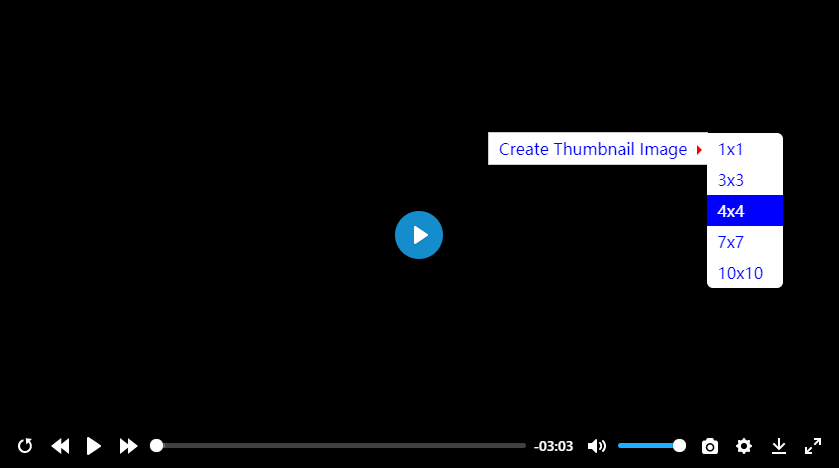
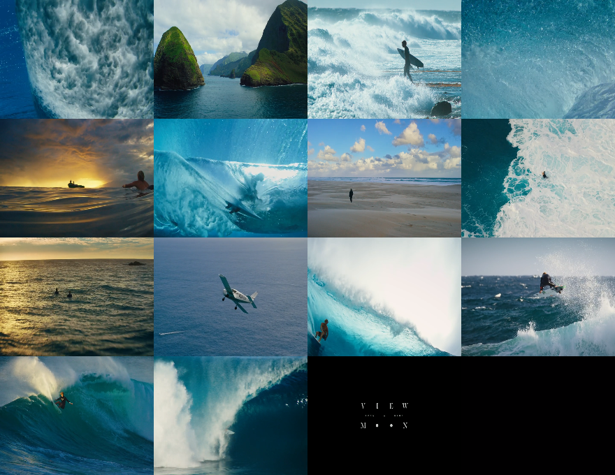

# plyr-thumbnail-generate
plyr player generate thumbnail on fly
动态生成缩略图插件

[示例 Demo](https://zengde.github.io/plyr-thumbnail-generate/)


结果 


# 使用方法
1.使用现代浏览器 

2.在 `plyr.js` 后添加 `plyr-thumbnail-generate.js`
```html
<script src="path/to/plyr.js"></script>
<!-- 当 after选项 为 thumbnail 时 -->
<script src="path/to/plyr-plugin-thumbnail.js"></script>
<script src="path/to/plyr-thumbnail-generate.js"></script>
<script>
    const player = new Plyr('#player');
</script>
```

3.添加 thumbnailCreate 配置

选项 | 类型 |  默认 | 描述  
-|-|-|-
after | String | download | 生成缩略图后操作<br> `download` 下载缩略图<br> `poster` 设置为封面<br> `thumbnail` 设置为预览图（与 [预览](https://github.com/zengde/plyr-plugin-thumbnail) 插件配合使用）
width | Number | 220 | 每个小图宽度
height | Number | 170 | 每个小图高度

示例：
```
// 其他 plyr 配置
thumbnailCreate:{
    after:'download',
    width:220,
    height:170
},
```

4.在主播放器容器右键菜单选择

# 注意
chrome 视频使用相对地址时设置currentTime失效 解决方法 将video `src` 改为在线视频完整引用地址

# 其他插件
1. [截图](https://github.com/zengde/plyr-plugin-capture)
2. [预览](https://github.com/zengde/plyr-plugin-thumbnail)
3. [生成缩略图](https://github.com/zengde/plyr-thumbnail-generate)